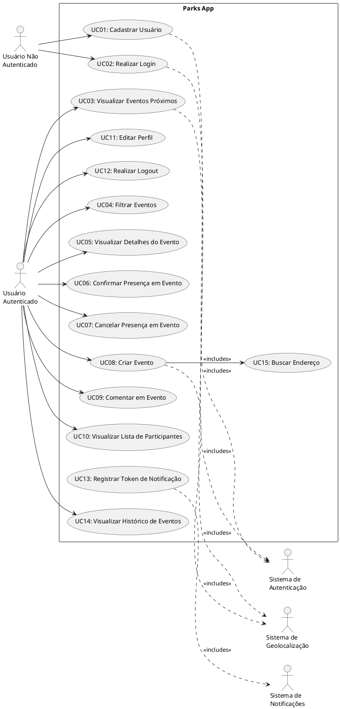

# Documentação de Casos de Uso - Parks App

## 1. Introdução

Este documento descreve os casos de uso do sistema Parks App, uma aplicação móvel para gerenciamento de eventos em parques e espaços públicos.

## 2. Atores

### 2.1 Usuário Não Autenticado
Pessoa que acessa o aplicativo mas ainda não fez login ou cadastro.

### 2.2 Usuário Autenticado
Pessoa que realizou cadastro e está logada no sistema, podendo criar eventos e interagir com a plataforma.

### 2.3 Sistema de Notificações (Expo Push Notifications)
Sistema externo responsável pelo envio de notificações push aos usuários.

### 2.4 Sistema de Autenticação (Supabase Auth)
Sistema externo responsável pela autenticação e gerenciamento de sessões.

### 2.5 Sistema de Geolocalização (Mapbox)
Sistema externo responsável por fornecer mapas e funcionalidades de geolocalização.

---

## 3. Casos de Uso

### UC01 - Cadastrar Usuário

**Ator Principal:** Usuário Não Autenticado

**Pré-condições:**
- O usuário não possui conta no sistema
- O aplicativo está instalado e aberto

**Fluxo Principal:**
1. Usuário acessa a tela de cadastro
2. Sistema exibe formulário de cadastro
3. Usuário preenche email e senha
4. Usuário confirma cadastro
5. Sistema valida os dados inseridos
6. Sistema cria conta via Supabase Auth
7. Sistema cria perfil do usuário na tabela profiles
8. Sistema exibe mensagem de sucesso
9. Sistema redireciona para tela de login

**Fluxos Alternativos:**
- **FA01:** Email já cadastrado
  - 5a. Sistema detecta que email já existe
  - 5b. Sistema exibe mensagem de erro
  - 5c. Retorna ao passo 3

- **FA02:** Dados inválidos
  - 5a. Sistema detecta dados inválidos (email mal formatado, senha fraca)
  - 5b. Sistema exibe mensagem de erro específica
  - 5c. Retorna ao passo 3

**Pós-condições:**
- Conta de usuário criada no sistema
- Perfil do usuário criado no banco de dados

---

### UC02 - Realizar Login

**Ator Principal:** Usuário Não Autenticado

**Pré-condições:**
- O usuário possui conta cadastrada
- O aplicativo está instalado e aberto

**Fluxo Principal:**
1. Usuário acessa a tela de login
2. Sistema exibe formulário de login
3. Usuário insere email e senha
4. Usuário confirma login
5. Sistema valida as credenciais via Supabase Auth
6. Sistema cria sessão do usuário
7. Sistema armazena token de sessão criptografado (LargeSecureStore)
8. Sistema redireciona para tela principal (mapa de eventos)

**Fluxos Alternativos:**
- **FA01:** Credenciais inválidas
  - 5a. Sistema detecta credenciais incorretas
  - 5b. Sistema exibe mensagem de erro
  - 5c. Retorna ao passo 3

**Pós-condições:**
- Usuário autenticado no sistema
- Sessão ativa criada
- Token armazenado de forma segura

---

### UC03 - Visualizar Eventos Próximos

**Ator Principal:** Usuário Autenticado

**Pré-condições:**
- Usuário está autenticado
- Permissão de localização concedida

**Fluxo Principal:**
1. Usuário acessa a tela principal (tab "Events")
2. Sistema obtém localização atual do usuário
3. Sistema chama função `nearby_events` ou `nearby_events_with_filters` do banco
4. Sistema exibe mapa com marcadores dos eventos próximos
5. Sistema exibe lista de eventos abaixo do mapa
6. Usuário pode rolar a lista para ver mais eventos

**Fluxos Alternativos:**
- **FA01:** Localização não disponível
  - 2a. Sistema não consegue obter localização
  - 2b. Sistema exibe mensagem solicitando permissão
  - 2c. Sistema usa localização padrão ou exibe todos os eventos

- **FA02:** Nenhum evento encontrado
  - 3a. Sistema não encontra eventos próximos
  - 3b. Sistema exibe mensagem "Nenhum evento próximo encontrado"

**Pós-condições:**
- Eventos próximos exibidos ao usuário

---

### UC04 - Filtrar Eventos

**Ator Principal:** Usuário Autenticado

**Pré-condições:**
- Usuário está na tela de eventos
- Existem eventos cadastrados

**Fluxo Principal:**
1. Usuário acessa opções de filtro
2. Sistema exibe filtros disponíveis (busca por texto, intervalo de datas)
3. Usuário define critérios de filtro
4. Usuário aplica filtros
5. Sistema chama `nearby_events_with_filters` com os parâmetros
6. Sistema atualiza lista de eventos conforme filtros
7. Sistema exibe resultados filtrados

**Fluxos Alternativos:**
- **FA01:** Nenhum evento corresponde aos filtros
  - 6a. Sistema não encontra eventos com os critérios
  - 6b. Sistema exibe mensagem "Nenhum evento encontrado"

**Pós-condições:**
- Lista de eventos filtrada conforme critérios do usuário

---

### UC05 - Visualizar Detalhes do Evento

**Ator Principal:** Usuário Autenticado

**Pré-condições:**
- Usuário está visualizando lista de eventos
- Evento existe no sistema

**Fluxo Principal:**
1. Usuário seleciona um evento da lista
2. Sistema navega para tela de detalhes (`/event/[id]`)
3. Sistema carrega informações completas do evento
4. Sistema exibe título, descrição, data, local, imagem
5. Sistema exibe número de participantes confirmados
6. Sistema exibe capacidade máxima (se definida)
7. Sistema exibe se é evento exclusivo para mulheres
8. Sistema exibe botão de confirmação de presença
9. Sistema exibe seção de comentários

**Fluxos Alternativos:**
- **FA01:** Evento não encontrado
  - 3a. Sistema não encontra evento com o ID fornecido
  - 3b. Sistema exibe mensagem de erro
  - 3c. Sistema retorna para tela anterior

**Pós-condições:**
- Detalhes completos do evento exibidos ao usuário

---

### UC06 - Confirmar Presença em Evento

**Ator Principal:** Usuário Autenticado

**Pré-condições:**
- Usuário está visualizando detalhes de um evento
- Usuário ainda não confirmou presença neste evento

**Fluxo Principal:**
1. Usuário clica no botão de confirmar presença
2. Sistema valida se há vagas disponíveis (se houver limite)
3. Sistema cria registro na tabela `attendance`
4. Sistema atualiza contador de participantes
5. Sistema atualiza interface mostrando presença confirmada
6. Sistema pode enviar notificação ao criador do evento

**Fluxos Alternativos:**
- **FA01:** Evento lotado
  - 2a. Sistema detecta que capacidade máxima foi atingida
  - 2b. Sistema exibe mensagem "Evento lotado"
  - 2c. Caso de uso é encerrado

- **FA02:** Usuário já confirmou presença
  - 2a. Sistema detecta registro existente de attendance
  - 2b. Sistema oferece opção de cancelar presença
  - 2c. Ver UC07

**Pós-condições:**
- Presença do usuário registrada no evento
- Contador de participantes atualizado

---

### UC07 - Cancelar Presença em Evento

**Ator Principal:** Usuário Autenticado

**Pré-condições:**
- Usuário confirmou presença anteriormente no evento

**Fluxo Principal:**
1. Usuário clica no botão de cancelar presença
2. Sistema remove registro da tabela `attendance`
3. Sistema atualiza contador de participantes
4. Sistema atualiza interface mostrando presença cancelada

**Pós-condições:**
- Presença do usuário removida do evento
- Contador de participantes atualizado

---

### UC08 - Criar Evento

**Ator Principal:** Usuário Autenticado

**Pré-condições:**
- Usuário está autenticado

**Fluxo Principal:**
1. Usuário acessa a tab "Create"
2. Sistema exibe formulário de criação de evento
3. Usuário preenche título do evento (obrigatório)
4. Usuário preenche descrição do evento (opcional)
5. Usuário seleciona data e hora do evento
6. Usuário seleciona localização no mapa ou digita endereço
7. Sistema converte endereço em coordenadas (geocoding)
8. Usuário pode adicionar foto do evento
9. Sistema faz upload da imagem para Supabase Storage (se fornecida)
10. Usuário define capacidade máxima (opcional)
11. Usuário marca se é evento exclusivo para mulheres (opcional)
12. Usuário confirma criação
13. Sistema valida dados obrigatórios
14. Sistema cria registro na tabela `events` com location_point (PostGIS)
15. Sistema exibe mensagem de sucesso
16. Sistema redireciona para detalhes do evento criado

**Fluxos Alternativos:**
- **FA01:** Campos obrigatórios não preenchidos
  - 13a. Sistema detecta campos obrigatórios vazios
  - 13b. Sistema exibe mensagens de erro
  - 13c. Retorna ao passo 3

- **FA02:** Erro no upload da imagem
  - 9a. Sistema não consegue fazer upload da imagem
  - 9b. Sistema exibe mensagem de erro
  - 9c. Sistema permite continuar sem imagem ou tentar novamente

- **FA03:** Localização inválida
  - 7a. Sistema não consegue geocodificar o endereço
  - 7b. Sistema exibe mensagem de erro
  - 7c. Retorna ao passo 6

**Pós-condições:**
- Novo evento criado no sistema
- Evento visível para outros usuários próximos

---

### UC09 - Comentar em Evento

**Ator Principal:** Usuário Autenticado

**Pré-condições:**
- Usuário está visualizando detalhes de um evento

**Fluxo Principal:**
1. Usuário rola até a seção de comentários
2. Usuário clica no campo de texto de comentário
3. Usuário escreve comentário
4. Usuário pode adicionar uma imagem ao comentário (opcional)
5. Sistema faz upload da imagem (se fornecida)
6. Usuário envia comentário
7. Sistema cria registro na tabela `comments`
8. Sistema atualiza lista de comentários em tempo real
9. Sistema exibe novo comentário com informações do perfil do usuário

**Fluxos Alternativos:**
- **FA01:** Comentário vazio
  - 6a. Sistema detecta comentário sem texto
  - 6b. Sistema exibe mensagem de erro
  - 6c. Retorna ao passo 3

- **FA02:** Erro no upload da imagem
  - 5a. Sistema não consegue fazer upload da imagem
  - 5b. Sistema exibe mensagem de erro
  - 5c. Sistema permite enviar comentário sem imagem ou tentar novamente

**Pós-condições:**
- Comentário adicionado ao evento
- Comentário visível para todos os usuários

---

### UC10 - Visualizar Lista de Participantes

**Ator Principal:** Usuário Autenticado

**Pré-condições:**
- Usuário está visualizando detalhes de um evento
- Evento possui participantes confirmados

**Fluxo Principal:**
1. Usuário clica em "Ver participantes" ou acessa `/event/[id]/attendance`
2. Sistema carrega lista de registros da tabela `attendance` para o evento
3. Sistema busca informações dos perfis dos participantes
4. Sistema exibe lista com avatar e nome dos participantes
5. Sistema exibe total de participantes confirmados

**Fluxos Alternativos:**
- **FA01:** Nenhum participante confirmado
  - 2a. Sistema não encontra registros de attendance
  - 2b. Sistema exibe mensagem "Nenhum participante confirmado ainda"

**Pós-condições:**
- Lista de participantes exibida ao usuário

---

### UC11 - Editar Perfil

**Ator Principal:** Usuário Autenticado

**Pré-condições:**
- Usuário está autenticado

**Fluxo Principal:**
1. Usuário acessa a tab "Profile"
2. Sistema exibe informações atuais do perfil
3. Usuário clica em editar perfil
4. Sistema exibe formulário de edição
5. Usuário pode alterar nome completo (full_name)
6. Usuário pode alterar nome de usuário (username)
7. Usuário pode alterar foto de perfil (avatar_url)
8. Sistema faz upload da nova foto (se fornecida)
9. Usuário pode adicionar website
10. Usuário confirma alterações
11. Sistema valida dados
12. Sistema atualiza registro na tabela `profiles`
13. Sistema exibe mensagem de sucesso

**Fluxos Alternativos:**
- **FA01:** Nome de usuário já existe
  - 11a. Sistema detecta username duplicado
  - 11b. Sistema exibe mensagem de erro
  - 11c. Retorna ao passo 6

- **FA02:** Erro no upload da foto
  - 8a. Sistema não consegue fazer upload da foto
  - 8b. Sistema exibe mensagem de erro
  - 8c. Sistema permite continuar com foto anterior ou tentar novamente

**Pós-condições:**
- Informações do perfil atualizadas
- Alterações visíveis em todos os lugares onde o perfil aparece

---

### UC12 - Realizar Logout

**Ator Principal:** Usuário Autenticado

**Pré-condições:**
- Usuário está autenticado

**Fluxo Principal:**
1. Usuário acessa opção de logout (geralmente no perfil)
2. Sistema exibe confirmação de logout (opcional)
3. Usuário confirma logout
4. Sistema encerra sessão via Supabase Auth
5. Sistema remove token armazenado
6. Sistema limpa estado de autenticação
7. Sistema redireciona para tela de login

**Pós-condições:**
- Sessão encerrada
- Usuário deslogado do sistema

---

### UC13 - Registrar Token de Notificação

**Ator Principal:** Sistema de Notificações

**Pré-condições:**
- Usuário autenticado concedeu permissão para notificações
- Aplicativo possui token Expo Push

**Fluxo Principal:**
1. Sistema obtém token de notificação do Expo
2. Sistema valida formato do token
3. Sistema registra/atualiza token na tabela `expo_push_tokens`
4. Sistema associa token ao user_id atual
5. Token fica disponível para envio de notificações

**Fluxos Alternativos:**
- **FA01:** Token inválido
  - 2a. Sistema detecta formato inválido
  - 2b. Sistema registra erro em log
  - 2c. Caso de uso é encerrado

- **FA02:** Usuário já possui token
  - 3a. Sistema atualiza token existente ao invés de criar novo

**Pós-condições:**
- Token de notificação registrado para o usuário
- Sistema pode enviar notificações push

---

### UC14 - Visualizar Histórico de Eventos

**Ator Principal:** Usuário Autenticado

**Pré-condições:**
- Usuário está autenticado
- Usuário confirmou presença em eventos anteriores

**Fluxo Principal:**
1. Usuário acessa a tab "History"
2. Sistema carrega eventos onde usuário confirmou presença
3. Sistema filtra eventos por data (passados ou futuros)
4. Sistema exibe lista de eventos
5. Usuário pode clicar em qualquer evento para ver detalhes

**Fluxos Alternativos:**
- **FA01:** Nenhum evento no histórico
  - 2a. Sistema não encontra registros de attendance do usuário
  - 2b. Sistema exibe mensagem "Você ainda não participou de nenhum evento"

**Pós-condições:**
- Histórico de eventos do usuário exibido

---

### UC15 - Buscar Endereço (Autocomplete)

**Ator Principal:** Usuário Autenticado

**Pré-condições:**
- Usuário está criando evento
- Campo de localização está ativo

**Fluxo Principal:**
1. Usuário começa a digitar endereço
2. Sistema monitora entrada de texto
3. Sistema consulta serviço de geocoding (após delay)
4. Sistema exibe sugestões de endereços
5. Usuário seleciona endereço da lista
6. Sistema preenche campo com endereço completo
7. Sistema obtém coordenadas (latitude/longitude)
8. Sistema atualiza marcador no mapa

**Fluxos Alternativos:**
- **FA01:** Nenhum resultado encontrado
  - 4a. Sistema não encontra sugestões para o texto
  - 4b. Sistema exibe mensagem "Nenhum endereço encontrado"

- **FA02:** Erro na API de geocoding
  - 3a. Sistema não consegue consultar serviço
  - 3b. Sistema permite entrada manual de coordenadas

**Pós-condições:**
- Endereço selecionado e coordenadas definidas

---

## 4. Diagrama de Casos de Uso (PlantUML)

---

## 5. Matriz de Rastreabilidade

| Caso de Uso | Requisitos Funcionais Relacionados |
|-------------|-----------------------------------|
| UC01 | RF01 - Cadastro de Usuário |
| UC02 | RF02 - Login de Usuário |
| UC03 | RF03 - Visualização de Eventos Próximos, RF13 - Geolocalização |
| UC04 | RF04 - Filtrar Eventos |
| UC05 | RF05 - Visualizar Detalhes de Evento |
| UC06 | RF06 - Confirmar Presença |
| UC07 | RF07 - Cancelar Presença |
| UC08 | RF08 - Criar Evento, RF09 - Upload de Imagens, RF13 - Geolocalização |
| UC09 | RF10 - Comentar em Eventos, RF09 - Upload de Imagens |
| UC10 | RF11 - Visualizar Participantes |
| UC11 | RF12 - Editar Perfil, RF09 - Upload de Imagens |
| UC12 | RF14 - Logout |
| UC13 | RF15 - Notificações Push |
| UC14 | RF16 - Histórico de Eventos |
| UC15 | RF17 - Autocomplete de Endereços |

