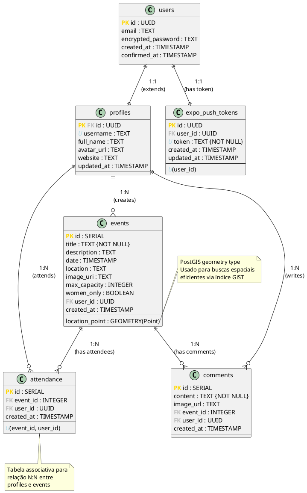
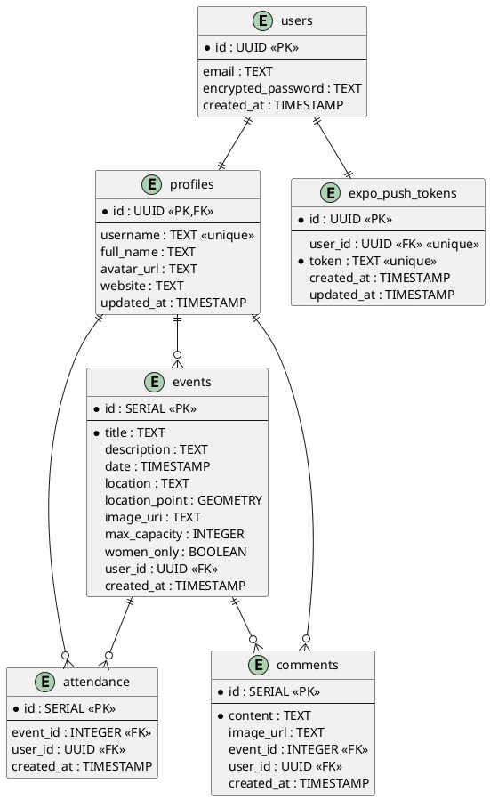

# Diagrama de Entidades - Parks App

## 1. Introdução

Este documento apresenta o modelo de dados do sistema Parks App utilizando o paradigma de Diagrama de Classes adaptado para banco de dados relacional. Como o projeto utiliza React Native (não orientado a objetos no backend), representamos as tabelas do banco de dados como entidades/classes.

---

## 2. Descrição das Entidades

### 2.1 users (Supabase Auth)
Tabela gerenciada automaticamente pelo Supabase Auth para autenticação.

**Atributos:**
- `id` (UUID, PK): Identificador único do usuário
- `email` (TEXT): Email do usuário
- `encrypted_password` (TEXT): Senha criptografada
- `created_at` (TIMESTAMP): Data de criação da conta
- `confirmed_at` (TIMESTAMP): Data de confirmação do email

**Observação:** Esta tabela é gerenciada pelo Supabase e não é acessada diretamente pela aplicação.

---

### 2.2 profiles
Perfil estendido do usuário com informações adicionais.

**Atributos:**
- `id` (UUID, PK, FK → users.id): Identificador único (referência ao usuário auth)
- `username` (TEXT, UNIQUE): Nome de usuário único
- `full_name` (TEXT): Nome completo do usuário
- `avatar_url` (TEXT): URL da foto de perfil
- `website` (TEXT): Website pessoal
- `updated_at` (TIMESTAMP): Data da última atualização

**Relacionamentos:**
- 1:1 com `users` (herda o id do usuário de autenticação)
- 1:N com `events` (um perfil pode criar vários eventos)
- 1:N com `attendance` (um perfil pode confirmar presença em vários eventos)
- 1:N com `comments` (um perfil pode fazer vários comentários)
- 1:1 com `expo_push_tokens` (um perfil tem um token de notificação)

---

### 2.3 events
Eventos criados pelos usuários.

**Atributos:**
- `id` (SERIAL, PK): Identificador único do evento
- `title` (TEXT, NOT NULL): Título do evento
- `description` (TEXT): Descrição detalhada do evento
- `date` (TIMESTAMP): Data e hora do evento
- `location` (TEXT): Endereço textual do evento
- `location_point` (GEOMETRY(Point)): Coordenadas geográficas (PostGIS)
- `image_uri` (TEXT): URL da imagem do evento
- `max_capacity` (INTEGER): Capacidade máxima de participantes
- `women_only` (BOOLEAN): Indica se é evento exclusivo para mulheres
- `user_id` (UUID, FK → profiles.id): Criador do evento
- `created_at` (TIMESTAMP): Data de criação do evento

**Relacionamentos:**
- N:1 com `profiles` (muitos eventos pertencem a um usuário)
- 1:N com `attendance` (um evento pode ter vários participantes)
- 1:N com `comments` (um evento pode ter vários comentários)

**Índices:**
- Índice espacial em `location_point` para buscas geográficas eficientes

---

### 2.4 attendance
Registro de confirmação de presença em eventos.

**Atributos:**
- `id` (SERIAL, PK): Identificador único do registro
- `event_id` (INTEGER, FK → events.id): Evento relacionado
- `user_id` (UUID, FK → profiles.id): Usuário que confirmou presença
- `created_at` (TIMESTAMP): Data da confirmação

**Relacionamentos:**
- N:1 com `events` (vários registros de presença para um evento)
- N:1 com `profiles` (vários registros de presença de um usuário)

**Constraints:**
- UNIQUE(event_id, user_id) - Um usuário só pode confirmar presença uma vez por evento

---

### 2.5 comments
Comentários feitos em eventos.

**Atributos:**
- `id` (SERIAL, PK): Identificador único do comentário
- `content` (TEXT, NOT NULL): Conteúdo do comentário
- `image_url` (TEXT): URL de imagem anexada ao comentário (opcional)
- `event_id` (INTEGER, FK → events.id): Evento comentado
- `user_id` (UUID, FK → profiles.id): Autor do comentário
- `created_at` (TIMESTAMP): Data de criação do comentário

**Relacionamentos:**
- N:1 com `events` (vários comentários para um evento)
- N:1 com `profiles` (vários comentários de um usuário)

---

### 2.6 expo_push_tokens
Tokens para envio de notificações push.

**Atributos:**
- `id` (UUID, PK): Identificador único do token
- `user_id` (UUID, FK → users.id): Usuário dono do token
- `token` (TEXT, UNIQUE, NOT NULL): Token Expo Push
- `created_at` (TIMESTAMP): Data de criação
- `updated_at` (TIMESTAMP): Data da última atualização

**Relacionamentos:**
- 1:1 com `users` (um usuário tem apenas um token ativo)

**Constraints:**
- UNIQUE(user_id) - Um usuário pode ter apenas um token ativo
- UNIQUE(token) - Cada token é único no sistema

---

## 3. Funções do Banco de Dados

### 3.1 nearby_events
Função que retorna eventos próximos a uma localização.

**Parâmetros:**
- `lat` (NUMERIC): Latitude da posição atual
- `long` (NUMERIC): Longitude da posição atual

**Retorno:**
- Lista de eventos com distância calculada em metros
- Ordenados por proximidade

**Uso:** Alimentar o mapa e a lista de eventos na tela principal

---

### 3.2 nearby_events_with_filters
Função que retorna eventos próximos com filtros adicionais.

**Parâmetros:**
- `lat` (NUMERIC): Latitude da posição atual
- `long` (NUMERIC): Longitude da posição atual
- `page_limit` (INTEGER): Limite de resultados por página
- `page_offset` (INTEGER): Offset para paginação
- `search_query` (TEXT): Texto para busca no título/descrição
- `date_from` (TIMESTAMP): Data inicial do filtro
- `date_to` (TIMESTAMP): Data final do filtro

**Retorno:**
- Lista de eventos filtrados com distância calculada
- Suporta paginação e busca textual

**Uso:** Filtrar eventos conforme critérios do usuário

---

## 4. Diagrama de Entidades (Notação UML)



---

## 5. Diagrama Entidade-Relacionamento (Notação Chen/Crow's Foot)



---

## 6. Dicionário de Dados

### 6.1 Tipos de Dados Especiais

| Tipo | Descrição | Uso |
|------|-----------|-----|
| UUID | Identificador único universal de 128 bits | Chaves primárias de usuários |
| SERIAL | Inteiro auto-incrementado | Chaves primárias de eventos, comentários, etc |
| TIMESTAMP | Data e hora com timezone | Datas de criação e eventos |
| GEOMETRY(Point) | Tipo PostGIS para coordenadas geográficas | Localização dos eventos |
| TEXT | String de tamanho variável | Textos diversos |
| BOOLEAN | Verdadeiro ou falso | Flags como women_only |

---

### 6.2 Constraints e Regras de Negócio

| Constraint | Tabela | Descrição |
|------------|--------|-----------|
| profiles.id FK users.id | profiles | Perfil deve ter usuário correspondente |
| events.user_id FK profiles.id | events | Evento deve ter criador válido |
| UNIQUE(event_id, user_id) | attendance | Usuário confirma presença apenas uma vez |
| UNIQUE(username) | profiles | Nome de usuário único no sistema |
| UNIQUE(token) | expo_push_tokens | Token de notificação único |
| UNIQUE(user_id) | expo_push_tokens | Um token por usuário |
| NOT NULL title | events | Todo evento deve ter título |
| NOT NULL content | comments | Todo comentário deve ter conteúdo |

---

## 7. Índices e Performance

### 7.1 Índices Espaciais
- `events.location_point`: Índice GiST para buscas geográficas eficientes
- Usado pelas funções `nearby_events` e `nearby_events_with_filters`

### 7.2 Índices de Chave Estrangeira
- `events.user_id`
- `attendance.event_id`
- `attendance.user_id`
- `comments.event_id`
- `comments.user_id`
- `expo_push_tokens.user_id`

### 7.3 Índices Únicos
- `profiles.username`
- `expo_push_tokens.token`
- `expo_push_tokens.user_id`

---

## 8. Segurança (Row Level Security - RLS)

Todas as tabelas implementam Row Level Security do Supabase:

### profiles
- Usuários podem ler todos os perfis
- Usuários podem atualizar apenas o próprio perfil

### events
- Usuários podem ler todos os eventos
- Usuários podem criar eventos
- Usuários podem atualizar/deletar apenas os próprios eventos

### attendance
- Usuários podem ler todas as confirmações
- Usuários podem criar/deletar apenas as próprias confirmações

### comments
- Usuários podem ler todos os comentários
- Usuários podem criar comentários
- Usuários podem deletar apenas os próprios comentários

### expo_push_tokens
- Usuários podem gerenciar apenas o próprio token
- Service role pode ler todos os tokens (para envio de notificações)

---

## 9. Cardinalidades Resumidas

| Relacionamento | Cardinalidade | Descrição |
|----------------|---------------|-----------|
| users ↔ profiles | 1:1 | Um usuário tem um perfil |
| profiles ↔ events | 1:N | Um usuário cria vários eventos |
| profiles ↔ attendance | 1:N | Um usuário confirma presença em vários eventos |
| events ↔ attendance | 1:N | Um evento tem vários participantes |
| profiles ↔ comments | 1:N | Um usuário faz vários comentários |
| events ↔ comments | 1:N | Um evento tem vários comentários |
| users ↔ expo_push_tokens | 1:1 | Um usuário tem um token de notificação |

---

## 10. Diagrama Completo com Multiplicidades

```
users (1) ──────── (1) profiles
                      │
                      ├── (1) ──── (*) events
                      │               │
                      ├── (1) ──── (*) attendance ──── (*) ← (1) events
                      │
                      └── (1) ──── (*) comments ──── (*) ← (1) events

users (1) ──────── (1) expo_push_tokens
```

